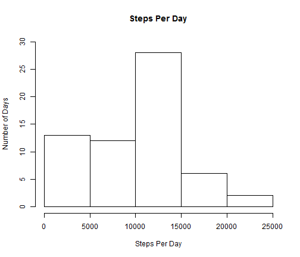
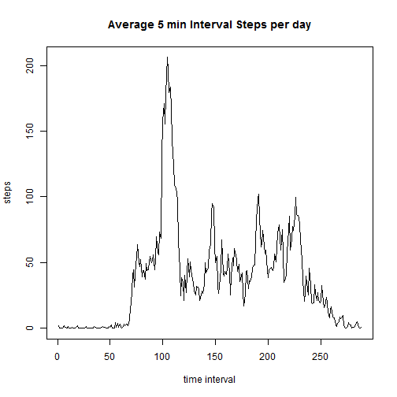
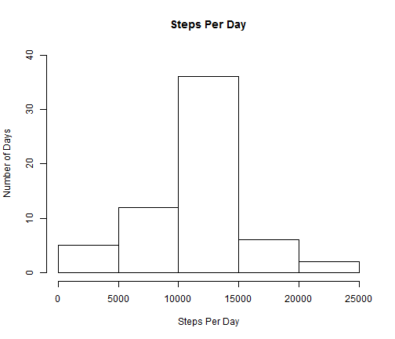

Reproducible Research - Project 1
========================================================

Reading in data and calculating the total number of steps per day, mean and median steps per day


```r
activity<-read.csv("activity.csv")
StepsPerDay<-tapply(activity$steps,activity$date,sum,na.rm=TRUE)
```

Plotting Average Steps per day


```r
hist(StepsPerDay,xlab="Steps Per Day",ylab = "Number of Days",ylim=c(0,30),main="Steps Per Day")
```

 

calculating Mean and Median Steps per day

```r
meanSteps<-mean(StepsPerDay,na.rm=TRUE)
medianSteps<-median(StepsPerDay,na.rm=TRUE)
```
Mean Steps per day is 9354.2295082 Median Steps per day is 10395

Plotting 5-minute interval (x-axis) and the average number of steps taken, averaged across all days (y-axis)

```r
timeSeries<-tapply(activity$steps,activity$interval,mean,na.rm=TRUE)
plot(timeSeries,type="l",main="Average 5 min Interval Steps per day",xlab="time interval",ylab="steps")
```

 

```r
maxInterval<-names(which.max(timeSeries))
```
The 5 minute interval with the max val is 835


```r
NumNa<-sum(is.na(activity$steps))
```
Number of NA values 2304

### Imputing Missing Values
Replacing missing NA values with the average value of that particular time interval


```r
FixedActivity<-activity
for (i in 1:nrow(FixedActivity)){
  if(is.na(FixedActivity[i,1])){
    FixedActivity[i,1]<-timeSeries[[as.character(FixedActivity[i,"interval"])]]
  }
}
```

Calculating Average Steps per day for fixed data

```r
StepsPerDay<-tapply(FixedActivity$steps,FixedActivity$date,sum,na.rm=TRUE)
```

Plotting Average Steps per day for fixed data


```r
hist(StepsPerDay,xlab="Steps Per Day",ylab = "Number of Days",ylim=c(0,40),main="Steps Per Day")
```

 

calculating Mean and Median Steps per day for fixed data

```r
NewMeanSteps<-mean(StepsPerDay,na.rm=TRUE)
NewMedianSteps<-median(StepsPerDay,na.rm=TRUE)
```
Mean Steps per day is 1.0766189 &times; 10<sup>4</sup> Median Steps per day is 1.0766189 &times; 10<sup>4</sup>

The impact of fixing the data is that the average steps per day increased from 9354.2295082 to 1.0766189 &times; 10<sup>4</sup>
